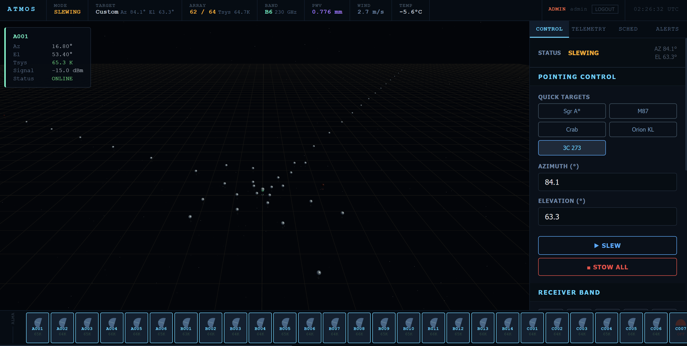

# ATMOS — Atacama Telescope Monitoring and Operations System

[](https://python.org)
[](https://fastapi.tiangolo.com)
[](https://react.dev)
[](https://threejs.org)
[](LICENSE)

A high-fidelity **SCADA (Supervisory Control and Data Acquisition)** simulation platform for real-time monitoring and control of radio telescope arrays at the Atacama Desert Observatory. ATMOS replicates the operational environment of ALMA (Atacama Large Millimeter/submillimeter Array) and associated facilities, incorporating physically accurate atmospheric models, interferometric science visualizations, and a production-grade WebSocket telemetry pipeline.

---

## Preview



> *ATMOS control interface showing 62/64 antennas online, slewing to target 3C 273 at Az 84.1° El 63.3°*

---

## Table of Contents

- [Overview](#overview)
- [System Architecture](#system-architecture)
- [Physical Models](#physical-models)
- [Features](#features)
- [Tech Stack](#tech-stack)
- [Getting Started](#getting-started)
- [API Reference](#api-reference)
- [Simulated Facilities](#simulated-facilities)
- [Roadmap](#roadmap)
- [References](#references)

---

## Overview

ATMOS is designed as both a **research prototype** and an **educational tool** for radio observatory operations. The system simulates the complete telemetry pipeline from antenna-level sensor data through atmospheric modelling to operator-facing dashboards — using the same physical equations employed by real ALMA operations software.

Key distinguishing characteristics:

- **Physically accurate Tsys model** — implements the full radiometric equation from the ALMA Technical Handbook (Cycle 10), including band-dependent receiver temperatures, atmospheric opacity scaling, and Kasten-Young airmass correction
- **Real site meteorology** — integrates live weather data from Open-Meteo API at ALMA/Chajnantor coordinates (lat −23.019°, lon −67.753°, alt 5058 m), with PWV derived via the Clausius-Clapeyron relation
- **Interferometric science displays** — UV-coverage plot with ENU→UVW transform and baseline correlation matrix with RFI detection, implementing standard interferometry mathematics
- **Production infrastructure** — JWT/RBAC authentication, resilient WebSocket with exponential backoff, InfluxDB time-series integration, and Docker Compose deployment stack

---

## System Architecture

```
┌──────────────────────────────────────────────────────────────┐
│                         BROWSER                              │
│                                                              │
│  ┌────────────┐  ┌───────────┐  ┌──────────┐   ┌──────────┐  │
│  │ 3D Scene   │  │ Dashboard │  │ UV-Plot  │   │Correlator│  │
│  │ (Three.js) │  │ (Zustand) │  │(Science) │   │(Science) │  │
│  └─────┬──────┘  └─────┬─────┘  └────┬─────┘   └────┬─────┘  │
│        └───────────────┴─────────────┴──────────────┘        │
│                              │                               │
│              Zustand Stores (telemetry, alerts, selection)   │
│                              │                               │
│              resilientWS.js (reconnect + IndexedDB buffer)   │
└──────────────────────────────┼───────────────────────────────┘
                               │  WebSocket  ws://:8000/ws/telemetry
┌──────────────────────────────┼───────────────────────────────┐
│                         FASTAPI                              │
│                              │                               │
│              ConnectionPool → broadcast(N clients, 1 Hz)     │
│                              │                               │
│             ( alma_sim.get_system_snapshot() )               │
│              │               │              │                │
│        physics_models  pointing_sim    weather_fetcher       │
│        (Tsys, τ, X)   (slew/track)   (Open-Meteo API)        │
└──────────────────────────────────────────────────────────────┘
```

WebSocket frames are broadcast at **1 Hz** to all connected clients simultaneously via `asyncio.gather`. Each frame carries the complete system snapshot (~50 antenna states + atmosphere + system metadata) serialised as JSON, typically 8–15 KB per frame.

---

## Physical Models

### System Temperature

The system noise temperature for each antenna is computed from the standard radiometric equation (ALMA Technical Handbook, Cycle 10, Eq. 9.8–9.11):

```
Tsys = T_rx + η · T_atm · (1 − e^(−τ_band · X)) + T_CMB · e^(−τ_band · X)
```

| Symbol | Definition | Value |
|--------|-----------|-------|
| T_rx | Receiver noise temperature (band-dependent) | 26–230 K |
| η | Forward efficiency | 0.95 |
| T_atm | Effective atmospheric temperature at Chajnantor | 270 K |
| T_CMB | Cosmic Microwave Background | 2.73 K |
| τ_band | Band opacity = τ_scale[band] × τ₂₂₅GHz | — |
| X | Airmass (Kasten-Young 1989) | sec(z) corrected |

### Atmospheric Opacity

Opacity at 225 GHz is derived from Precipitable Water Vapour (PWV) using the Danese-Partridge approximation:

```
τ₂₂₅ ≈ 0.04 · PWV + 0.012
```

PWV is estimated from in-situ meteorological data via the Clausius-Clapeyron relation and hydrostatic integration (Pardo et al. 2001, ATM model).

### Airmass

The Kasten-Young (1989) formula is used in preference to the simple secant approximation, providing accuracy to ±0.1% down to 5° elevation:

```
X = 1 / [sin(el) + 0.50572 · (el + 6.07995)^(−1.6364)]
```

### UV-Coverage

Baseline vectors in the UV-plane are computed from the ENU→UVW coordinate transform for each antenna pair (i, j):

```
u = dE · cos(H) − dN · sin(H)
v = dE · sin(δ)sin(H) + dN · sin(δ)cos(H) − dU · cos(δ)
```

where H is the hour angle and δ is source declination. Both (u, v) and conjugate (−u, −v) are plotted, reflecting the Hermitian symmetry of the visibility function.

---

## Features

### Operational (Implemented)

| Feature | Description |
|---------|-------------|
| **WebSocket Telemetry** | 1 Hz broadcast to N simultaneous clients via `asyncio.gather` with dead-connection pruning |
| **3D Array Visualisation** | Interactive Three.js scene — dishes animate Az/El in real time, click to inspect individual antenna |
| **Physically Accurate Tsys** | Per-dish system temperature from ALMA Technical Handbook radiometric equation |
| **Live Atmosphere** | PWV, τ₂₂₅GHz, wind, temperature from Open-Meteo API (Chajnantor lat/lon), 5-minute cache with simulation fallback |
| **Alert Engine** | Rule-based detection: dish offline, Tsys > 100/130 K, wind > 20/25 m/s, PWV > 2 mm, low elevation |
| **SCADA Control Panel** | Slew to Az/El, stow all, band selection (B1–B10), obs mode, fault injection |
| **UV-Coverage Plot** | Real ENU→UVW transform, band-scaled wavelength, HA sweep animation, angular resolution readout |
| **Baseline Correlator** | N×N visibility matrix, amplitude/phase toggle, MAD-based RFI flagging, fault annotation |
| **Pointing Simulation** | Realistic slew rate (3°/s az, 1.5°/s el), smooth interpolation, settling phase, stow position El 15° |
| **JWT + RBAC** | Four-tier access control: viewer → operator → engineer → admin |
| **Resilient WebSocket** | Exponential backoff (1s–60s), IndexedDB offline buffer, data-gap detection, RTT display |
| **InfluxDB Integration** | Batch-buffered async writer (flush every 50 points or 10 s); lazy init; auto-disables when `INFLUX_TOKEN` unset; errors suppressed so telemetry loop is unaffected |
| **Observation Scheduler** | Priority-based async queue (`urgent/high/normal/low`) with real-time constraint evaluation (elevation, PWV, wind); 1 s tick engine; pre-seeded with 5 targets (Sgr A\*, M87, Orion KL, 3C 273, Crab Nebula); operator+ reorder/remove; 20-entry history log |
| **Auth UI** | Terminal-aesthetic login page (CRT scanlines, blinking cursor, amber prompt); quick-fill buttons for demo roles; role badge + username + logout in dashboard header; demo mode local fallback when backend unreachable |
| **Docker Compose** | Traefik + TLS, InfluxDB 2.7, Grafana 11, Redis, multi-stage Dockerfiles |
| **REST API** | Swagger UI at `/docs`, full OpenAPI 3.1 schema |
| **Sparkline Graphs** | Live Tsys, PWV, wind, τ history with configurable thresholds |
| **Dish Panel** | Scrollable antenna list with online/offline filter, sort by ID / Tsys / status |

---

## Tech Stack

| Layer | Technology | Version |
|-------|-----------|---------|
| Frontend framework | React | 19.x |
| Build tool | Vite | 6.x |
| 3D rendering | Three.js + @react-three/fiber + drei | r184 / 9.x |
| State management | Zustand | 5.x |
| Charting | Recharts | 3.x |
| Backend framework | FastAPI + Uvicorn | 0.136 / 0.44 |
| Language | Python | 3.13 |
| Data validation | Pydantic | 2.x |
| Authentication | python-jose (JWT) + passlib (bcrypt) | — |
| Time-series DB | InfluxDB | 2.7 |
| Monitoring | Grafana | 11 |
| Cache / queue | Redis | 7 |
| Reverse proxy | Traefik | 3.1 |
| Containerisation | Docker + Compose | — |
| Weather API | Open-Meteo | — |

---

## Getting Started

### Prerequisites

- Python 3.11+ (tested on 3.13)
- Node.js 18+ and npm
- Git

### Development (local)

**1. Clone**
```bash
git clone https://github.com/Majimety/ATMOS-Atacama-Telescope-Monitoring-and-Operations-System.git
cd ATMOS-Atacama-Telescope-Monitoring-and-Operations-System
```

**2. Backend**
```bash
cd server
python -m venv venv

# Windows
venv\Scripts\activate
# macOS / Linux
source venv/bin/activate

pip install -r requirements.txt
uvicorn main:app --reload
```

Backend runs at `http://localhost:8000`
Interactive API docs: `http://localhost:8000/docs`

**3. Frontend** (new terminal)
```bash
cd client
npm install
npm run dev
```

Frontend runs at `http://localhost:5173`

> **Demo accounts** — if the backend is unreachable, the login page validates locally:
>
> | Role | Username | Password |
> |------|----------|----------|
> | admin | `admin` | `admin123` |
> | engineer | `engineer` | `engineer123` |
> | operator | `operator` | `operator123` |
> | viewer | `viewer` | `viewer123` |

### Production (Docker)

```bash
cp .env.example .env          # configure secrets and domain
docker compose -f docker/docker-compose.yml pull
docker compose -f docker/docker-compose.yml up -d
```

Services: ATMOS API, Nginx frontend, InfluxDB, Grafana, Redis, Traefik (TLS auto-provisioned via Let's Encrypt).

---

## API Reference

Full interactive documentation is available at `http://localhost:8000/docs` (Swagger UI) or `http://localhost:8000/redoc` (ReDoc).

### REST Endpoints

| Method | Path | Auth | Description |
|--------|------|------|-------------|
| `GET` | `/` | — | System status and version |
| `GET` | `/health` | — | Health check with current pointing state |
| `GET` | `/api/telescopes/` | viewer+ | List all antenna states |
| `GET` | `/api/atmosphere/` | viewer+ | Current meteorological data |
| `GET` | `/api/control/pointing` | viewer+ | Current pointing (az, el, mode) |
| `POST` | `/api/control/slew` | operator+ | Command array to Az/El |
| `POST` | `/api/control/stow` | operator+ | Stow all antennas to El 15° |
| `POST` | `/api/control/band/{band}` | operator+ | Set receiver band (1–10) |
| `POST` | `/api/control/mode/{mode}` | operator+ | Set observation mode |
| `POST` | `/api/control/fault` | engineer+ | Inject or clear antenna fault |
| `GET` | `/api/scheduler` | viewer+ | Get scheduler state (active job + queue + history) |
| `POST` | `/api/scheduler/jobs` | operator+ | Enqueue a new observation job |
| `DELETE` | `/api/scheduler/jobs/{id}` | operator+ | Remove a queued job |
| `POST` | `/api/scheduler/jobs/{id}/move` | operator+ | Reorder job up/down in queue |
| `POST` | `/api/scheduler/skip` | operator+ | Skip the current active job |
| `GET` | `/api/influx/status` | — | InfluxDB writer diagnostics |

### WebSocket

**Endpoint:** `ws://localhost:8000/ws/telemetry`

Pass a valid JWT as a query parameter: `ws://localhost:8000/ws/telemetry?token=<access_token>`

If the token is omitted, the connection is accepted as an anonymous viewer (demo/dev mode). If the token is present but invalid, the server closes with code **4403**.

**Server → Client** (1 Hz, JSON):
```json
{
  "timestamp": "2025-04-23T07:15:00.000Z",
  "system":    { "band": 6, "freq_ghz": 230, "obs_mode": "interferometry", "fault_count": 2 },
  "atmosphere":{ "pwv_mm": 0.52, "tau_225ghz": 0.033, "wind_ms": 8.4, "temp_c": -6.2, "weather_source": "live" },
  "alma":      { "dishes": [...], "online_count": 63, "total_count": 64, "avg_tsys_k": 80.5 },
  "pointing_mode": "tracking",
  "scheduler": { "active": { "target_name": "Sgr A*", "progress_pct": 42.0 }, "stats": { "queued": 3 } }
}
```

**Client → Server** (commands):
```json
{ "type": "slew",         "az": 183.7, "el": 52.4, "target_name": "Sgr A*" }
{ "type": "stow" }
{ "type": "set_band",     "band": 7 }
{ "type": "set_mode",     "mode": "vlbi" }
{ "type": "inject_fault", "dishId": "B005", "offline": true }
{ "type": "clear_fault",  "dishId": "B005" }
{ "type": "emergency_stop" }
```

---

## Simulated Facilities

### ALMA Array (primary)

| Pad series | Arm | Max baseline | Antenna type |
|-----------|-----|-------------|-------------|
| A001–A006 | Central core | ~40 m | DA / DV |
| B001–B014 | Northeast (~60°) | ~900 m | DA / DV |
| C001–C014 | Northwest (~300°) | ~1050 m | DA / DV |
| D001–D014 | South (~180°) | ~1300 m | DA / DV |
| ACA01–ACA12 | Compact (Morita) | ~50 m | CM (7 m) |

Positions derived from ALMA C43-5 configuration (CASA/NRAO public data). Angular resolution at Band 6 (230 GHz) with 1.3 km baseline: **θ ≈ λ/B_max ≈ 0.23 arcsec**.

### ALMA Receiver Bands Simulated

| Band | Frequency | Typical Tsys | Primary science use |
|------|-----------|-------------|-------------------|
| B3 | 84–116 GHz | 45 K | CO(1-0), HCN, dense gas tracers |
| B6 | 211–275 GHz | 55 K | CO(2-1), dust continuum *(most used)* |
| B7 | 275–370 GHz | 75 K | HCO⁺, submillimetre continuum |
| B9 | 602–720 GHz | 175 K | Near 620 GHz H₂O line |

All 10 ALMA bands (B1–B10) are selectable in the control panel.

---

## Roadmap

### Recently Completed

- [x] **Observation scheduling queue** — priority-based async engine with real-time constraint evaluation (elevation, PWV, wind)
- [x] **InfluxDB live writer activation** — batch-buffered writer connected to the WebSocket broadcast loop; lazy init; graceful degradation
- [x] **Auth UI** — terminal-aesthetic login page with role indicator, demo mode fallback, and logout in dashboard header
- [x] **Grafana dashboard templates** — pre-built panels for Tsys trends, PWV history, and array health over time

### Near-term

- [ ] **Source catalogue integration** — searchable catalogue (Simbad/NED API) for target selection by name
- [ ] **Observation sensitivity calculator** — estimate RMS noise as a function of bandwidth, integration time, Tsys, and number of antennas
- [ ] **seed.py schema sync** — update `influx/seed.py` to match current WebSocket frame fields (e.g. `scheduler` block)

### Medium-term

- [ ] **Multi-array mode** — toggle between ALMA, APEX, and EHT node displays

### Long-term

- [ ] **Real correlator interface** — replace `simulateVisibilities()` in `BaselineCorrelator.jsx` with a live data feed
- [ ] **VLBI fringe detection** — simulate fringe rate and delay search for EHT-style VLBI baselines
- [ ] **Commissioning mode** — holography, pointing model fitting, and receiver tuning workflows

---

## Project Structure

```
ATMOS-ATACAMA-TELESCOPE-MONITORING-AND-OPERATIONS-SYSTEM/
├── client/
│   ├── public/
│   │   ├── favicon.svg
│   │   └── icons.svg
│   ├── src/
│   │   ├── assets/
│   │   │   ├── hero.png
│   │   │   ├── react.svg
│   │   │   └── vite.svg
│   │   ├── components/
│   │   │   ├── AlertFeed.jsx             Event log with severity triage
│   │   │   ├── BaselineCorrelator.jsx    N×N visibility matrix + MAD RFI flagging
│   │   │   ├── ControlPanel.jsx          SCADA control interface (slew, band, mode, fault)
│   │   │   ├── Dashboard.jsx             System status overview panel
│   │   │   ├── SchedulerPanel.jsx        Observation queue UI + history log
│   │   │   ├── TelemetryGraphs.jsx       Live sparkline graphs (Tsys, PWV, wind, τ)
│   │   │   ├── TelescopePanel.jsx        Scrollable antenna list with filter/sort
│   │   │   └── UVCoveragePlot.jsx        UV-plane visualisation (ENU→UVW, HA sweep)
│   │   ├── hooks/
│   │   │   ├── useTelemetry.js           Snapshot → store → alert pipeline
│   │   │   └── useWebSocket.js           WebSocket connection hook
│   │   ├── libs/
│   │   │   └── resilientWS.js            Production WS client: backoff, IndexedDB buffer, gap detect, RTT
│   │   ├── pages/
│   │   │   ├── Config.jsx                Settings / configuration page
│   │   │   ├── LoginPage.jsx             Terminal-aesthetic auth screen (CRT scanlines, amber prompt)
│   │   │   └── Main.jsx                  Main entry page
│   │   ├── store/
│   │   │   ├── alertEngine.js            Rule-based alert detection (Tsys, wind, PWV, dish state)
│   │   │   ├── alertStore.js             Zustand: alert queue (max 300 events)
│   │   │   ├── auth.js                   Auth state + JWT refresh timer + demo mode fallback
│   │   │   ├── telemetryStore.js         Zustand: live snapshot + 2-min rolling history
│   │   │   └── telescopeStore.js         Zustand: dish selection + filter/sort state
│   │   ├── three/
│   │   │   ├── DishMesh.jsx              Antenna 3D model with real-time Az/El animation
│   │   │   ├── Scene.jsx                 Three.js canvas + camera + lighting
│   │   │   ├── SkyDome.jsx               Night sky hemisphere + sidereal star rotation
│   │   │   └── TerrainMesh.jsx           Atacama plateau terrain mesh
│   │   ├── App.css
│   │   ├── App.jsx                       Root layout + login gate + role badge + tab navigation
│   │   ├── index.css
│   │   └── main.jsx                      Vite entry point
│   ├── .gitignore
│   ├── Dockerfile
│   ├── eslint.config.js
│   ├── index.html
│   ├── package-lock.json
│   ├── package.json
│   └── vite.config.js
├── docker/
│   ├── grafana/
│   │   ├── dashboards/
│   │   │   ├── atmos_array_health.json   Array health Grafana dashboard
│   │   │   ├── atmos_overview.json       System overview Grafana dashboard
│   │   │   ├── atmos_pwv_history.json    PWV history Grafana dashboard
│   │   │   └── atmos_tsys_trends.json    Tsys trends Grafana dashboard
│   │   └── provisioning/
│   │       ├── dashboards/
│   │       │   └── atmos.yml
│   │       └── datasources/
│   │           └── influxdb.yml
│   ├── docker-compose.yml                Full production stack (API + Nginx + InfluxDB + Grafana)
│   ├── Dockerfile.client                 Nginx + Vite build container
│   └── Dockerfile.server                 FastAPI container (multi-stage Python build)
├── docs/
│   └── pictures/
│       └── ATMOS_Dashboard.png
├── influx/
│   ├── schema.flux                       Flux query examples for InfluxDB dashboards
│   └── seed.py                           Seed 24 h of historical telemetry data
├── server/
│   ├── app/
│   │   ├── api/
│   │   │   ├── __init__.py
│   │   │   ├── atmosphere.py             GET /api/atmosphere/ — meteorological data (viewer+)
│   │   │   ├── control.py                POST /api/control/{slew,stow,band,mode,fault} (operator+/engineer+)
│   │   │   ├── scheduler.py              REST scheduler CRUD: enqueue, remove, move, skip (operator+)
│   │   │   └── telescopes.py             GET /api/telescopes/ — antenna listing (viewer+)
│   │   ├── models/
│   │   │   ├── __init__.py
│   │   │   ├── connection_pool.py              ConnectionPool — WebSocket connection manager + broadcast
│   │   │   └── telescope.py              Pydantic data models for antenna state
│   │   ├── simulation/
│   │   │   ├── __init__.py
│   │   │   ├── alma_positions.py         Real ALMA C43-5 pad coordinates (ENU metres)
│   │   │   ├── alma_sim.py               Simulation engine + system snapshot builder
│   │   │   ├── atmosphere_sim.py         Fallback atmospheric simulation (diurnal cycle)
│   │   │   ├── physics_models.py         Tsys, airmass, DishPointing, signal computations (ALMA spec)
│   │   │   ├── pointing_sim.py           Global pointing controller (slew/track, 3°/s az, 1.5°/s el)
│   │   │   └── weather_fetcher.py        Open-Meteo API client + PWV/τ derivation (5-min cache)
│   │   ├── ws/
│   │   │   ├── __init__.py
│   │   │   ├── events.py                 WebSocket event type constants
│   │   │   └── telemetry.py              WebSocket endpoint + command dispatch + scheduler/influx wiring
│   │   ├── __init__.py
│   │   └── obs_queue.py                  Observation scheduling queue + async tick engine (singleton)
│   ├── auth.py                           JWT authentication + RBAC (4 roles: viewer/operator/engineer/admin)
│   ├── Dockerfile
│   ├── influx_writer.py                  InfluxDB async batch writer (lazy init, auto-disable, persistent client)
│   ├── main.py                           FastAPI application + WebSocket endpoint + legacy REST shims
│   └── requirements.txt
├── .env.example                          Environment variable template
├── .gitignore
├── ARCHITECTURE.md                       Detailed system architecture and design decisions
├── LICENSE
├── README.md
└── TELESCOPE_DATA.md                     Physical parameters and reference data for all simulated facilities
```

---

## Source Code Reference

The following section provides a structured list of all source files in this project.  
Click to expand and view direct access links to each file.

<details>
  <summary><b>View Full Source Code List</b></summary>

---

### Backend (FastAPI)

**Core**
- main.py  
  https://raw.githubusercontent.com/Majimety/ATMOS-Atacama-Telescope-Monitoring-and-Operations-System/main/server/main.py  
- auth.py  
  https://raw.githubusercontent.com/Majimety/ATMOS-Atacama-Telescope-Monitoring-and-Operations-System/main/server/auth.py  
- influx_writer.py  
  https://raw.githubusercontent.com/Majimety/ATMOS-Atacama-Telescope-Monitoring-and-Operations-System/main/server/influx_writer.py  
- requirements.txt  
  https://raw.githubusercontent.com/Majimety/ATMOS-Atacama-Telescope-Monitoring-and-Operations-System/main/server/requirements.txt  
- Dockerfile  
  https://raw.githubusercontent.com/Majimety/ATMOS-Atacama-Telescope-Monitoring-and-Operations-System/main/server/Dockerfile  

**Models**
- telescope.py  
  https://raw.githubusercontent.com/Majimety/ATMOS-Atacama-Telescope-Monitoring-and-Operations-System/main/server/app/models/telescope.py  
- connection_pool.py  
  https://raw.githubusercontent.com/Majimety/ATMOS-Atacama-Telescope-Monitoring-and-Operations-System/main/server/app/models/connection_pool.py  

**Simulation**
- alma_sim.py  
  https://raw.githubusercontent.com/Majimety/ATMOS-Atacama-Telescope-Monitoring-and-Operations-System/main/server/app/simulation/alma_sim.py  
- alma_positions.py  
  https://raw.githubusercontent.com/Majimety/ATMOS-Atacama-Telescope-Monitoring-and-Operations-System/main/server/app/simulation/alma_positions.py  
- physics_models.py  
  https://raw.githubusercontent.com/Majimety/ATMOS-Atacama-Telescope-Monitoring-and-Operations-System/main/server/app/simulation/physics_models.py  
- pointing_sim.py  
  https://raw.githubusercontent.com/Majimety/ATMOS-Atacama-Telescope-Monitoring-and-Operations-System/main/server/app/simulation/pointing_sim.py  
- atmosphere_sim.py  
  https://raw.githubusercontent.com/Majimety/ATMOS-Atacama-Telescope-Monitoring-and-Operations-System/main/server/app/simulation/atmosphere_sim.py  
- weather_fetcher.py  
  https://raw.githubusercontent.com/Majimety/ATMOS-Atacama-Telescope-Monitoring-and-Operations-System/main/server/app/simulation/weather_fetcher.py  

**WebSocket**
- telemetry.py  
  https://raw.githubusercontent.com/Majimety/ATMOS-Atacama-Telescope-Monitoring-and-Operations-System/main/server/app/ws/telemetry.py  
- events.py  
  https://raw.githubusercontent.com/Majimety/ATMOS-Atacama-Telescope-Monitoring-and-Operations-System/main/server/app/ws/events.py  

**API**
- telescopes.py  
  https://raw.githubusercontent.com/Majimety/ATMOS-Atacama-Telescope-Monitoring-and-Operations-System/main/server/app/api/telescopes.py  
- atmosphere.py  
  https://raw.githubusercontent.com/Majimety/ATMOS-Atacama-Telescope-Monitoring-and-Operations-System/main/server/app/api/atmosphere.py  
- control.py  
  https://raw.githubusercontent.com/Majimety/ATMOS-Atacama-Telescope-Monitoring-and-Operations-System/main/server/app/api/control.py  
- scheduler.py  
  https://raw.githubusercontent.com/Majimety/ATMOS-Atacama-Telescope-Monitoring-and-Operations-System/main/server/app/api/scheduler.py  

**Initialization & Core Modules**
- app/__init__.py  
  https://raw.githubusercontent.com/Majimety/ATMOS-Atacama-Telescope-Monitoring-and-Operations-System/main/server/app/__init__.py  
- obs_queue.py  
  https://raw.githubusercontent.com/Majimety/ATMOS-Atacama-Telescope-Monitoring-and-Operations-System/main/server/app/obs_queue.py  

---

### Frontend (React + Vite)

**Core**
- package.json  
  https://raw.githubusercontent.com/Majimety/ATMOS-Atacama-Telescope-Monitoring-and-Operations-System/main/client/package.json  
- main.jsx  
  https://raw.githubusercontent.com/Majimety/ATMOS-Atacama-Telescope-Monitoring-and-Operations-System/main/client/src/main.jsx  
- App.jsx  
  https://raw.githubusercontent.com/Majimety/ATMOS-Atacama-Telescope-Monitoring-and-Operations-System/main/client/src/App.jsx  

**Hooks**
- useWebSocket.js  
  https://raw.githubusercontent.com/Majimety/ATMOS-Atacama-Telescope-Monitoring-and-Operations-System/main/client/src/hooks/useWebSocket.js  
- useTelemetry.js  
  https://raw.githubusercontent.com/Majimety/ATMOS-Atacama-Telescope-Monitoring-and-Operations-System/main/client/src/hooks/useTelemetry.js  

**State Management**
- telemetryStore.js  
  https://raw.githubusercontent.com/Majimety/ATMOS-Atacama-Telescope-Monitoring-and-Operations-System/main/client/src/store/telemetryStore.js  
- alertStore.js  
  https://raw.githubusercontent.com/Majimety/ATMOS-Atacama-Telescope-Monitoring-and-Operations-System/main/client/src/store/alertStore.js  
- alertEngine.js  
  https://raw.githubusercontent.com/Majimety/ATMOS-Atacama-Telescope-Monitoring-and-Operations-System/main/client/src/store/alertEngine.js  
- telescopeStore.js  
  https://raw.githubusercontent.com/Majimety/ATMOS-Atacama-Telescope-Monitoring-and-Operations-System/main/client/src/store/telescopeStore.js  
- auth.js  
  https://raw.githubusercontent.com/Majimety/ATMOS-Atacama-Telescope-Monitoring-and-Operations-System/main/client/src/store/auth.js  

**Components**
- Dashboard.jsx  
  https://raw.githubusercontent.com/Majimety/ATMOS-Atacama-Telescope-Monitoring-and-Operations-System/main/client/src/components/Dashboard.jsx  
- TelescopePanel.jsx  
  https://raw.githubusercontent.com/Majimety/ATMOS-Atacama-Telescope-Monitoring-and-Operations-System/main/client/src/components/TelescopePanel.jsx  
- ControlPanel.jsx  
  https://raw.githubusercontent.com/Majimety/ATMOS-Atacama-Telescope-Monitoring-and-Operations-System/main/client/src/components/ControlPanel.jsx  

---

### Infrastructure & Deployment

- docker-compose.yml  
  https://raw.githubusercontent.com/Majimety/ATMOS-Atacama-Telescope-Monitoring-and-Operations-System/main/docker/docker-compose.yml  
- Dockerfile.server  
  https://raw.githubusercontent.com/Majimety/ATMOS-Atacama-Telescope-Monitoring-and-Operations-System/main/docker/Dockerfile.server  
- Dockerfile.client  
  https://raw.githubusercontent.com/Majimety/ATMOS-Atacama-Telescope-Monitoring-and-Operations-System/main/docker/Dockerfile.client  

---

### Documentation

- ARCHITECTURE.md  
  https://raw.githubusercontent.com/Majimety/ATMOS-Atacama-Telescope-Monitoring-and-Operations-System/main/ARCHITECTURE.md  
- TELESCOPE_DATA.md  
  https://raw.githubusercontent.com/Majimety/ATMOS-Atacama-Telescope-Monitoring-and-Operations-System/main/TELESCOPE_DATA.md  
- README.md  
  https://raw.githubusercontent.com/Majimety/ATMOS-Atacama-Telescope-Monitoring-and-Operations-System/main/README.md  

---

</details>

---

## References

1. ALMA Partnership. *ALMA Technical Handbook, Cycle 10*. ALMA Observatory, 2023. [alma-telescope.org](https://almascience.nrao.edu/documents-and-tools)
2. Kasten, F. and Young, A. T. (1989). "Revised optical air mass tables and approximation formula." *Applied Optics*, 28(22), 4735–4738. [doi:10.1364/AO.28.004735](https://doi.org/10.1364/AO.28.004735)
3. Pardo, J. R., Cernicharo, J. and Serabyn, E. (2001). "Atmospheric transmission at microwaves (ATM): an improved model for millimeter/submillimeter applications." *IEEE Transactions on Antennas and Propagation*, 49(12), 1683–1694.
4. Otarola, A. et al. (2010). "Precipitable Water Vapor, Temperature, and Wind Statistics At Sites Suitable for mm and Submm Wavelength Astronomy in Northern Chile." *PASP*, 122(897), 1333. [doi:10.1086/657267](https://doi.org/10.1086/657267)
5. Thompson, A. R., Moran, J. M. and Swenson, G. W. (2017). *Interferometry and Synthesis in Radio Astronomy*, 3rd ed. Springer. ISBN 978-3-319-44431-4.

---

## License

MIT © 2025 — see [LICENSE](LICENSE) for details.